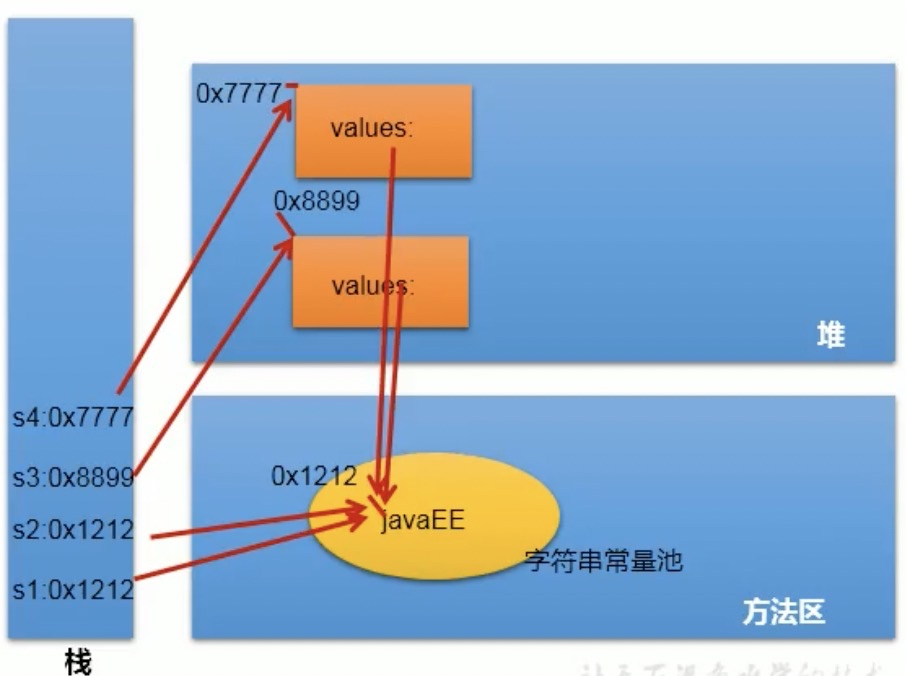
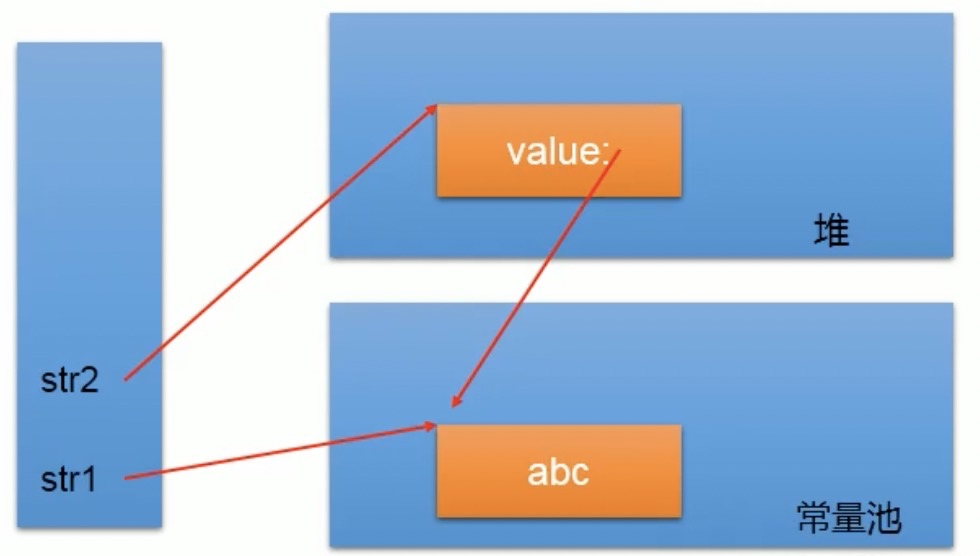

# String类的概述

 * String声明final的,不可被继承
 * String 
      * 实现了 Serializable 接口:表示字符串是支持序列化的
      * 实现了 Comparable   接口:表示String可以比较大小
 * String内部定义了 final char[] value用于存储字符串数据
 * String:代表不可变的字符序列。筒称:不可变性

     **不可变性的体现:**

  * 1.当对字符串重新赋值时,需要重写指定内存区域赋值,不能使用原有的value进行赋值

  	* 2.当对现有的字符串进行连接操作时,也需要重新指定内存区域赋值,不能使用原有的value

    * 3.当调用 string的 replace()方法修改指定字符或字符串时,也需要重新指定内存区域赋值,不能使用原有的value
    * 4.通过字面量的方式(区别new)给一个字符串赋值,此时的字符串值声明在字符串常量池中
    * 5.字符串常量池中是不会存储相同内容的字符串的

# String的实例化方式
* 方式一:通过字面量定义的方式

```
        //通过字面量定义的方式:此时的s1和2的数据 Javaee声明在方法区中的字符串常量池中
        String s1 = "Javaee";
        String s2 = "Javaee";
```
* 方式ニ:通过new+构造器的方式    

```
        //通过new+构造器的方式:此时的s3和s4保存的地址值,是数据在堆空间中开辟空间以后对应的地址值
        String s3 = new String("javaee");
        String s4 = new String("javaee");
```
举例：

```
        System.out.println(s1 == s2); //true
        System.out.println(s1 == s3); //false
        System.out.println(s1 == s4); //false
        System.out.println(s3 == s4); //false
```
由此可以得到字符串对象的存储结构
<div style="text-align: center;">


</div>


### 总结
* String str1 = "abc";与String str2 = new String("abc");的**区别**是什么呢
    * 字符串常量存储在字符串常量池，目的是共享
    * 字符串非常量对象存储在堆中
    <div style="text-align: center;">

</div> 

# String不同拼接的操作的对比
* 1.常量与常量的拼接结果在常量池。且常量池中不会存在相同内容的常量。
* 2.只要其中有一个是变量,结果就在堆中
* 3.如果拼接的结果调用 intern()方法,返回值就在常量池中

```
        String s1 = "javaee";
        String s2 = "hadoop";
        String s3 = "javaeehadoop";
        String s4 = "javaee" + "hadoop";
        String s5 = s1 + "hadoop";
        String s6 = "javaee" + s2;
        String s7 = s1 + s2;
        System.out.println(s3 == s4); //true
        System.out.println(s3 == s5); //false
        System.out.println(s3 == s6); //false
        System.out.println(s3 == s7); //false
        System.out.println(s5 == s6); //false
        System.out.println(s5 == s7); //false
        System.out.println(s6 == s7); //false
        
        String s8 = s6.intern();//返回值得到的s8使用的常量值中已经存在的"javaeehadoop"
        System.out.println(s3 == s8); //true

```

# String类的常用方法
 * **int length():**返回字符的长度: return value.length
  
 * **char charAt( int index):**返回某索引处的字符 return value [index]
  
 * **boolean isEmpty():**判断是否是空字符串: return value.length==0
  
 * **String toLowercase():**使用默认语言环境,将 String中的所有字符转换为小写
 
 * **String toUppercase():**使用默认语言环境,将 String中的所有字符转为大写

 * **String trim():**返回字符串的副本,忽略前导空白和尾部空白

 * **boolean equals( Object obj):**比较字符串的内容是否相同

 * **String concat( String str):**将指定字符串连接到此字符宇的结尾。等价于用"+"

 * **boolean equalsIgnoreCase( String anotherString):**与 equals方法类似,忽略大小写

 * **int compareTo( String anotherString):**比较两个字符串的大小

 * **String substring( int beginIndex):**返回一个新的字符串,它是此字符串的从 beginIndex开始截取到最后一个子字符串

 * **String substring( int beginIndex, int endIndex):**返回一个新字符串,它是此字符宇从 beginIndex开始截取到endIndex（不包含）的一个子字符串

```  
        String s1 = "HelloWorld";
        
        System.out.println(s1.length());//10
        
        System.out.println(s1.charAt(0));//H
        
        System.out.println(s1.isEmpty());//false
        
        System.out.println(s1.toLowerCase());//helloworld
        
        System.out.println(s1.toUpperCase());//HELLOWORLD
        
        String s2 = "  Hello  World  ";
        
        System.out.println(s2.trim());//Hello  World
        
        String s3 = "helloworld";
        
        System.out.println(s1.equals(s3));//false
        
        System.out.println(s1.equalsIgnoreCase(s3));//true
        
        String s4 = s1.concat(s3);
        System.out.println(s4);//HelloWorldhelloworld
        
        System.out.println(s1.compareTo(s3));//-32
        
        System.out.println(s1.substring(2));//lloWorld
        
        System.out.println(s1.substring(2, 5));//llo
```

* **boolean endsWith( String suffix):**测试此字符串是否以指定的后缀结束

* **boolean startsWith( String prefix):**测试此字符串是否以指定的前缀开始
* **boolean startsWith( String prefix, int toffset):**测试此字符串从指定索引开始的子字符串是否以指定的前缀开始

* **boolean contains（CharSequence s）:**当且仅当此字符串包含指定的char值序列时，返回true
* **int indexOf（String str）:**返回指定子字符串在此字符串中第一次出现处的索引
* **int indexOf（String str， int fromIndex）:** 返回指定子字符串在此字符串中第一次出现处的索引，从指定的索引开始
* **int lastIndexOf（String str）:**返回指定子字符串在此字符串中最右边出现处的索引
* **int lastIndexOf（String str， int fromIndex）:** 返回指定子字符串在此字符串中最后一次出现处的索引，从指定的索引开始方向搜索
    * 注: indexOf和astIndex0f方法如果未找到都是返回一1
```
        String str1 = "helloworld";
        
        boolean b1 = str1.endsWith("rld");
        
        System.out.println(b1);//true
        
        boolean b2 = str1.startsWith("He");
        System.out.println(b2);//false
        

        boolean b3 = str1.startsWith("ll", 2);
        System.out.println(b3);//true

        String str2 = "wo";
        System.out.println(str1.contains(str2));//true

        System.out.println(str1.indexOf("lo"));//3

        System.out.println(str1.indexOf("lo", 5));//-1

        String str3 = "hellorworld";
        System.out.println(str3.lastIndexOf("or"));//7

        System.out.println(str3.lastIndexOf("or", 6));//4      
```


* **String replace（char oldChar， char newChar）:**返回一个新的字符串，它是通过用newChar替换此字符串中出现的所有oldChar得到的。
* **String replace（CharSequence target， CharSequence replacement）:**使用指定的字面值替换序列替换此字符串所有匹配字面值目标序列的子字符串。
* **String replaceAll（String regex， String replacement）:** 使用给定的replacement 替换此字符串所有匹配给定的正则表达式的子字符串。
* **String replaceFirst（String regex， String replacement）:** 使用给定的replacement 替换此字符串匹配给定的正则表达式的第一个子字符串。
* **boolean matches（String regex）:**告知此字符串是否匹配给定的正则表达式。String[] split（String regex）:根据给定正则表达式的匹配拆分此字符串。
* **String[] split（String regex， int limit）:**根据匹配给定的正则表达式来拆分此字符串，最多不超过limit个，如果超过了，剩下的全部都放到最后一个元素中。
```
        String str1 = "1234567";
        String str2 = str1.replace('1', 'a');
        System.out.println(str2);//a234567

        String str = "12hello34world5java7891mysql456";
        //把字符串中的数字替换成，如果结果中开头和结尾有，的话去掉
        String string = str.replaceAll("\\d+", ",").replaceAll("^,|,$", "");
        System.out.println(string);//hello,world,java,mysql

        str = "12345";
        //判断str字符串中是否全部有数字组成，即有1一n个数字组成
        boolean matches = str.matches("\\d+");//true
        System.out.println(matches);
        String tel = "12345678";
        //判断这是否是一个杭州的固定电话
        boolean result = tel.matches("\\d{7,8}");
        System.out.println(result);//true

        str = "hello|world|java";
        String[] strs = str.split(" \\|");
        for (int i = 0; i < strs.length; i++) {
            System.out.println(strs[i]);//hello|world|java
        }
        System.out.println();
        str2 = "hello.world.java";
        String[] strs2 = str2.split("\\.");
        for (int i = 0; i < strs2.length; i++) {
            System.out.println(strs2[i]);//hello world java
        }
```

# String 的相互转化
* String 一> char[]: 调用String 的toCharArray()
* char[] 一> String: 调用String 的构造器

```
        String s1 = "123asd";
        char[] chars = s1.toCharArray();
        for (int i = 0; i < chars.length; i++) {
            System.out.print(chars[i]);//123asd
        }
        char[] chars1 = new char[]{'s', 'a', 'c'};
        String s2 = new String(chars1);
        System.out.println(s2);//sac
```

* String 一> byte[]: 调用String 的getBytes()
* byte[] 一> String: 调用String 的构造器

```
        String s = "abc123";
        byte[] bytes = s.getBytes();
        System.out.println(Arrays.toString(bytes));//[97, 98, 99, 49, 50, 51]
        String s1 = new String(bytes);
        System.out.println(s1);//abc123
```

# String、StringBuffer. StringBuilder三者的异同？

## 区别
 * String:不可变的字符序列；底层使用char[]存储
 * StringBuffer:可变的字符序列；线程安全的，效率低；底层使用char[]存储
 * StringBuilder:可变的字符序列； jdk5. 0新增的，线程不安全的，效率高；底层使用char[]存储
## 源码分析

``` 
String str = new String(): //char[] value = new char[0]；
String str1 = new String("abc")；//char[] vaLue = new char[]{'a'， 'b'， 'c'}；

StringBuffer sb1 = new StringBuffer()；//char[] value = new char[16]； 底层创建了一个长度16的数组
sb1. append('a')； //value[0] = 'a';
sb1. append('b')；//value[1] = 'b';
StringBuffer sb2 = new StringBuffer（ "abc"）； //char[] value = new char["abc". length() +16]
```
## 注意点
 * 1. System.out.println(sb2. length());//3
 * 2.扩容问题:如果要添加的数据底层数组盛不下了，那就需要扩容底层的数组。默认情况下，扩容为原来容量的2倍+ 2，同时将原有数组中的元素复制到新的数组中。

 
## 指导意义
开发中建议使用: 
`StringBuffer (int capacity)或StringBuffer (int capacity)`

# StringBuffer. StringBuilder的相关方法

* StringBuffer append（xxx）: 提供了很多的append()方法，用于进行字符串拼接
* StringBuffer delete（int start， int end）: 删除指定位置的内容
* StringBuffer replace（int start， int end， String str）:把[start，end） 位置替换为str
* StringBuffer insert（int offset， xxx）: 在指定位置插入xxx
* StringBuffer reverse() :把当前字符序列逆转
* public int indexOf（String str）
* pubLic String substring（int start， int end）返回一个从start开始到end索引结束的左闭右开区间的于字符串
* public int length（）
* public char charAt（int n ）
* public void setCharAt（int n ， char ch）

```
StringBuffer s = new StringBuffer("asd");
 
System.out.println(s.append(1));//asd1

System.out.println(s.delete(2, 3));//as1

System.out.println(s.replace(0, 1, "qwe"));//qwes1

System.out.println(s.insert(2, "aaaa"));//qwaaaaes1

System.out.println(s.reverse());//1seaaaawq
```
## 总结

* 增: append(xxx)
* 删: delete(int start, int end)
* 改: setCharAt(int n char ch) / replace(int start, int end, String str)
* 查: charAt(int n)
* 插: insert(int offset,xxx)
* 长度: length();
* 遍历: for() + charAt() / toString()